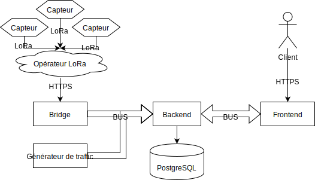

# Réunion du 7 novembre 2019

Présents: Quentin Gliech, Pascal Mérindol

## Avancements

- Bootstrap du backend
- Grands avancements niveau interface:
  - Les données sont pour l'instant fictives
  - Expérimentations avec Mapbox pour les cartes
- Un cluster Kubernetes haute-dispo déployé sur les 3 VMs
- Choix d'architecture: base PostgreSQL et bus NATS
- Expérimentations avec les shields LoRa (retardé par un gros manque de documentation)
- Ouverture du dépôt et ajout des CR de réunion

## Problèmes

- Impossible de se connecter au réseau LoRa
- Difficulté de trouver une architecture « micro-services » satisfaisante
- Beaucoup moins d'avancement que prévu durant les vacances de la toussaint
- Premier livrable retardé à cause des points précédents

## Travaux en cours

- Déploiement de PostgreSQL et NATS dans le cluster (Constantin, Quentin)
- Déploiement des applications (frontend, backend et bridge) dans le cluster (Constantin, Quentin)
- Création du schéma de base de données (Cyrille, Lionel)
- Exposer les données de la base au frontend (Cyrille)
- Lire les « vraies » données depuis le bus dans le frontend (Lionel)
- Faire fonctionner la communication LoRa du capteur (Maxime, Manal)
- Écrire le pont entre l'opérateur et notre bus (Manal)
- Écrire un programme de test pour simuler des données de capteurs (Maxime)

# Notes sur la réunion

- Voir Pierre Neumann et Guillaume Schreiner pour débogguer la connexion au réseau LoRa
- Formaliser les limitations de l'architecture (notamment les données perdues en cas de perte de machines)
- J'ai (Quentin) fait je pense pas mal ralentir l'avancement en voulant une architecture trop ambitieuse, sans trouver de compromis qui me satisfaisait.
  On est maintenant revenu à une architecture plus simple conceptuellement, et tout le monde a maintenant une tâche assez précise pour avancer.
