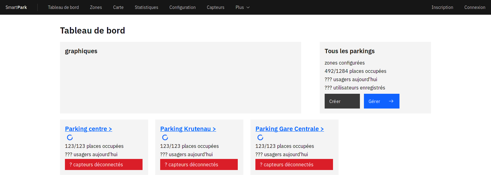
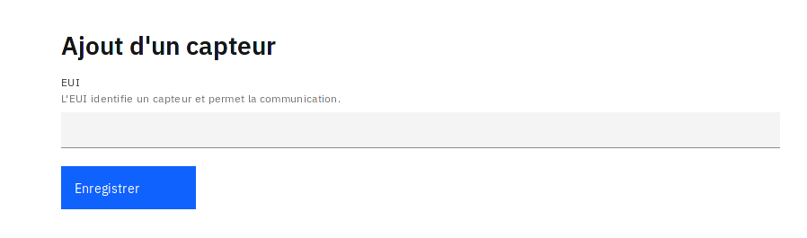

---
title: Documentation pour client
author: Smart Park
date: Version 0.1 - Décembre 2019
lang: fr-FR
fontsize: 12pt
#toc: true
#toc-title: Sommaire
mainfont: TeX Gyre Pagella
documentclass: memoir
classoption: 
    - a4paper
    - twoside
    - openany
    - titlepage
    - float
geometry:
    - margin=2.8cm
number-sections: true
header-includes: |
    \chapterstyle{bianchi}
...

# Introduction
Smart Park est une application qui permet de gérer un parking connecté. 
Le fonctionnement de Smart Park est très simple : vous installez des modules
de capteurs sur vos places de parking ; ces derniers détectent la présence 
d'un véhicule ; puis ces appareils sont connectés à l'Internet via un réseau
dédié à l'Internet des objets ; finalement vous pouvez gérer vos places de 
parking depuis notre application web. Les possibilités qu'offre notre solution 
sont nombreuses. Nous sommes toujours à l'écoute de nos clients afin de 
satisfaire des demandes particulières et de répondre le plus précisément à
leurs besoins. 
\
\
\
Une fois installé, votre parking connecté permettra aux usagers de trouver des
places de parking plus aisément sans devoir tourner en rond. Par conséquent, 
les trajets des usagers sont considérablement réduits provoquant ainsi une
diminution des embouteillages ainsi qu'un diminution de la polution. D'autre 
part, notre solution permet vous permet d'obtenir des statistiques sur vos 
parkings dans le but de comprendre les habitudes des usagers, identifier des 
zones critiques et améliorer vos performances. Un outil de gestion de la 
maintenance vous accompagnera pour assurer le bon fonctionnement de votre 
parking connecté, à des coûts réduits.

# FAQ

* **Pourquoi déployer un parking connectés ?** \
Le monde de demain sera entièrement (ou presque) connecté. Les parkings
n'échapperont pas à cette tendance. Lancez vous dès à présent dans un 
parking connecté afin d'en optimiser la gestion et proposer une meilleure 
qualité de service pour vos usagers. La recherche de place sera optimisée, 
réduisant le trajet à parcourir pour un usager et la pollution lié à ce 
déplacement.

* **Comment fonctionne un parking connecté ?** \
Des modules connectés contenant des capteurs magnétiques équipés de 
batteries sont installés sur chaque place de parking. Ces modules 
permettent de détecter la présence d'un véhicule. Ils sont connectés à
l'Internet via un réseau d'accès LoRaWAN, similaire aux réseaux mobiles,
à travers lequel ils envoient des informations à notre application web.
Ces modules sont très bon marchés mais également contraints par leur
batterie et puissance de calcul.

* **Quelles sont les avantages de Smart Park ?**\
Avec Smart Park, la gestion de vos places de parking connectés est
grandement simplifiée. Visualisez en temps réel l'état de vos parkings,
optenez des statistiques variées sur différentes échelles temporelles,
anticipez et programmez la maintenance de vos capteurs, faites des
économies.

* **Qu'ai-je besoin pour déployer un parking connecté ?**\
Dans un premier temps, il faut s'équiper de capteurs. Le client peut se
fournir de sa propre initiative mais nous proposons des modules tout 
prêt à un très bon tarif. Par la suite, notre équipe s'occupe de vous
créer une interface des gestion. Après l'intallation des capteurs sur 
vos places de parking et la formation de vos collaborateurs, vous êtes
fin prêt à gérer votre parking connecté !

* **Quel est le coût de cette solution ?** \
L'installation d'un capteur coûte environ l'équivalent de 10% du prix
de construction d'une place de parking. Le prix du déploiement complet 
de Smart Park est très variable selon le besoin. N'hésitez pas à nous
contacter pour un devis gratuit !

# Gestion d'un parking
Dans cette partie, nous allons aborders les principaux composants d'un
parking connecté:\
- Les capteurs.\
- Les places de parking.\
- Les zones de parking.\
Vous allez apprendre comment ajouter et configurer ces
composants sur notre application web. À partir d'ici, les capteurs sont
déjà installés sur les places et fonctionnels. Munissez vous de leurs 
indentifiants uniques, ou ***EUI***, pour passer à la suite. 
\
\
Le ***workflow*** classique pour débuter est :
1. Ajouter des capteurs à partir de l'***EUI***.
2. Créer une ou des zones de parking pour organiser vos places.
3. Créer des places de parking dans cette/ces zone(s).
4. Associer chaque place avec un capteur.
À partir de là, vous pouvez gérer aisément votre parking connecté. Vous pouvez
bien évidemment reconfigurer les différents composants.

## Vue générale
Lorsque vous vous connectez à votre espace utilisateur, vous tomber sur le tableau de
bord.

La barre de navigation au dessus de l'interface vous permet de naviguer sur notre
application.

## Les capteurs

### Ajouter un capteur
La première étape pour faire fonctionner l'application Smart Park, est d'ajouter 
des capteurs. Pour cela, rendez-vous dans l'onglet "Capteurs" sur votre interface
graphique (voir [Onglet "Capteurs" sur la barre de navigation])

Ensuite, cliquez sur la bouton "Ajouter".
\
\
**INCLURE IMAGE DU BOUTON ICI**
\
\
Un formulaire d'ajout apparait. Il suffit alors d'entrer l'EUI et de cliquer sur "Enregistrer". 
Votre capteur à été ajouté. Vous pouvez directement le vérifier dans l'onglet "Capteurs" sur
lequel vous avez été redirigé.

### Lister les capteurs non associés
Par la suite, vous pouvez retrouver les capteurs qui ne sont pas associé dans l'onglet
"Capteurs".

## Les zones
Une zone est caractérisée par une aire géographique et un type de place de parking
(i.e. payant, gratuit, zone bleue). Vous pouvez configurer des zones comme bon vous 
semble. Toutefois, nous recommandons de suivre une organisation cohérente et de
définir vos zones comme des parkings.

### Créer une zone
Pour créer une zone, rendez-vous sur 

### Configurer une zone

## Les places de parking
### Créer une place de parking
### Configurer une place de parking

## Visualiser
### Listes des zones
### Carte des zones

# Statistiques

## Statistiques globales

## Statistiques d'une zone

## Statistiques d'une place de parking

# Maintenance

## Planifier une maintenance

# Informations complémentaires

## Erreurs et exceptions
Des erreurs peuvent survenir lorsque vous interagissez avec l'interface web.
Lorsqu'elles surviennent, elles sont explicitement affichése sur votre écran.
Elles peuvent être dûent à des problèmes ponctuels auquel cas vous pouvez 
directement ressayer votre manipulation en rafraichissant la page. Si le
problème subsiste, nous vous invitons à contacter le support.

## Bugs
Un bug se caractérise par une anomalie du fonctionnement (i.e. le résultat
obtenu n'est pas le résultat souhaité). Vous n'aurez donc pas de page d'erreur
qui s'affiche. Veuillez immédiatement contacter le support afin que nous
puissions y remédier.

# Conclusion

Félicitation, vous êtes prêt à utiliser notre application web ! La gestion
de vos parking connectés n'a jamais été aussi simple qu'avec Smart Park. N'hésitez
pas à nous aider dans notre politique d'amélioration continue en envoyant
vos suggestions à notre équipe. 